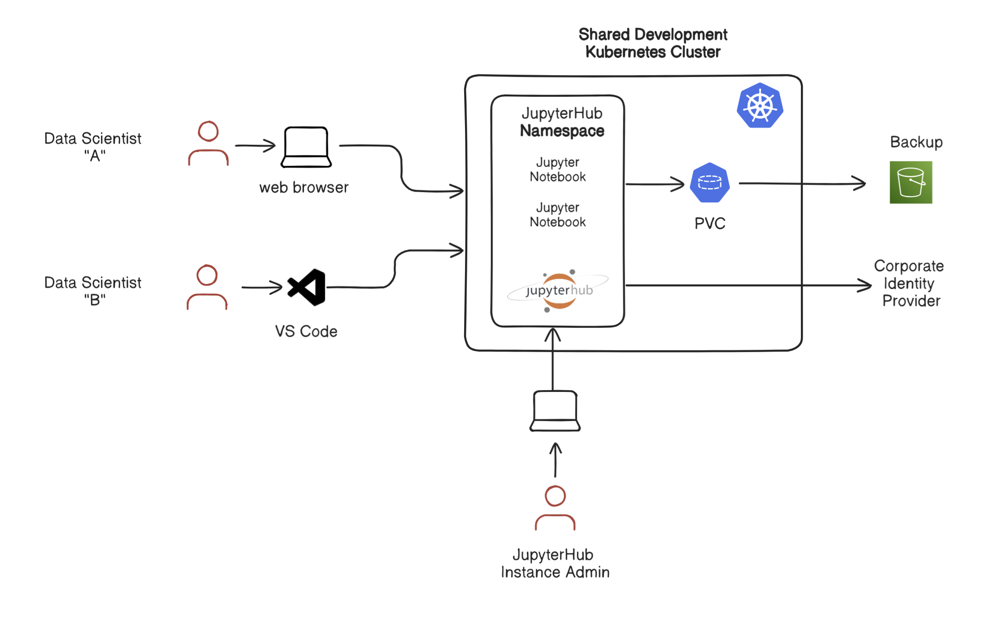

## Overview

This is a reference design and implementation of an environment template to provision a self-service environment of JupyterHub.  This envronment will work on any Kubernetes cluster using a LoadBalancer. This reference design is based on Rafay's Environment Manager.

[Learn](https://docs.rafay.co/refarch/jupyterhub/overview/) more about this template. 

## Contributing
This is authored by Rafay Solution Architects. We encourage and welcome contributions from the user community. If you have enhancements that you would like to share, please contact us. 
