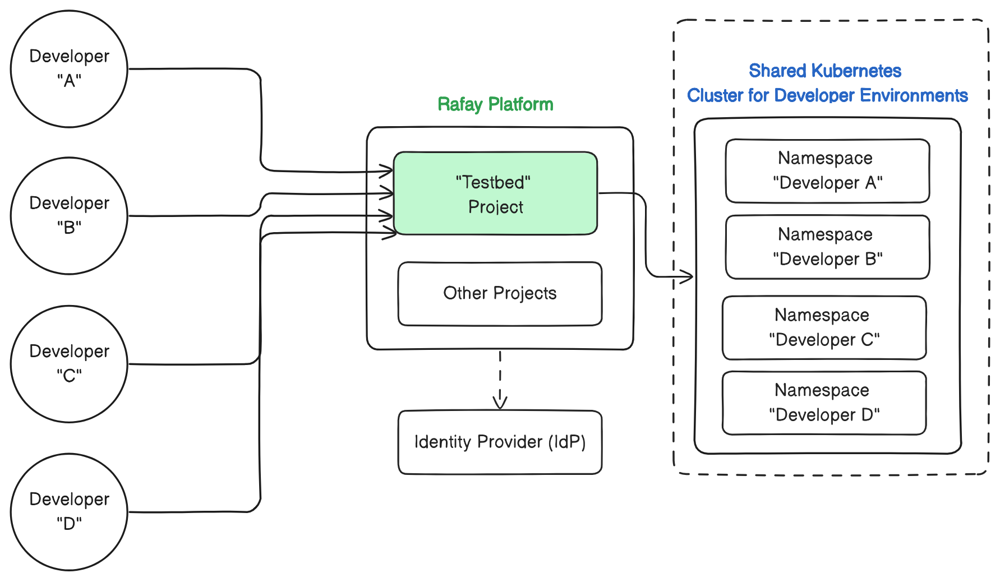

## Overview

This is a reference design and implementation of an environment template that can be implemented by platform teams to provide a "self-service" experience for developers to request and access a "Kubernetes Namespace" on a shared, host Cluster. The namespace will be secured by a network policy which denies all ingress and egress traffic.  In addition to the environment requestor having access to the namespace, an additional collaborator can be added to the namespace during environment creation.

[Learn](https://docs.rafay.co/refarch/naas/overview/) more about this template. 

## Contributing
This is authored by Rafay Solution Architects. We encourage and welcome contributions from the user community. If you have enhancements that you would like to share, please contact us. 
