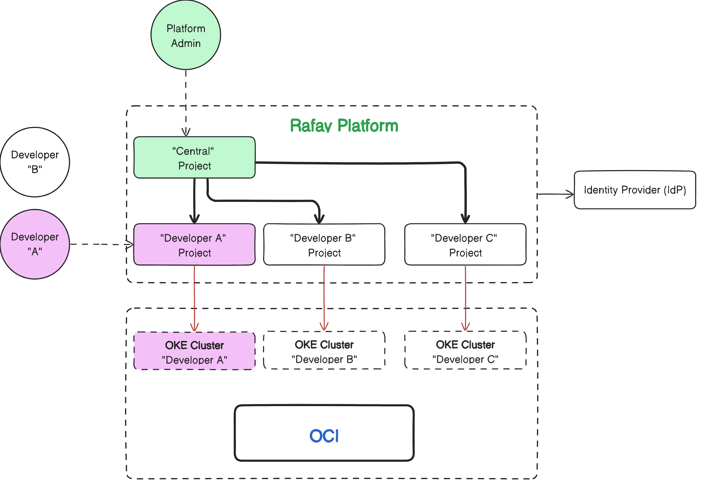
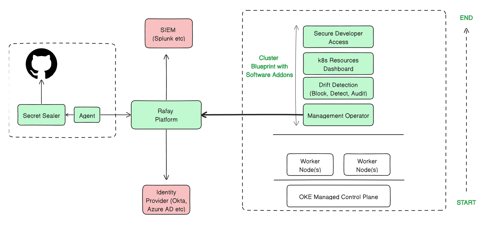

## Overview

This is a reference design and implementation of an environment template to provision a self-service cluster environment on Oracle OKE. This reference design is based on Rafay's Environment Manager.

This design assumes an OKE cluster will be created and assigned on-demand to the developer for their applications.

The following components will be created as part of the CaaS configuration.  A custom cluster blueprint will be created to deliver the software addons to the cluster.

[Learn](https://docs.rafay.co/refarch/caas/oke/101-caas-oke/overview) more about this template. 

## Contributing
This is authored by Rafay Solution Architects. We encourage and welcome contributions from the user community. If you have enhancements that you would like to share, please contact us. 
