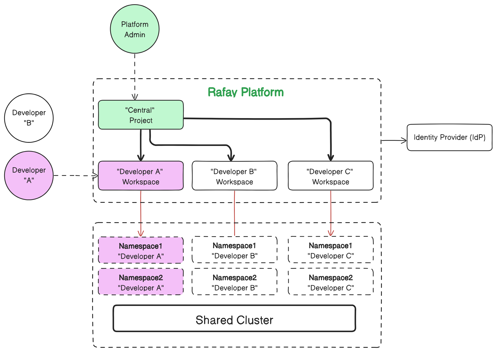

## Overview

This is a reference design and implementation of an environment template that can be implemented by platform teams to provide a "self-service" experience for developers to request and access a "Rafay Workspace" on a shared, host Cluster. 

[Learn](https://docs.rafay.co/refarch/waas/eks/overview/) more about this template. 

## Contributing
This is authored by Rafay Solution Architects. We encourage and welcome contributions from the user community. If you have enhancements that you would like to share, please contact us. 
